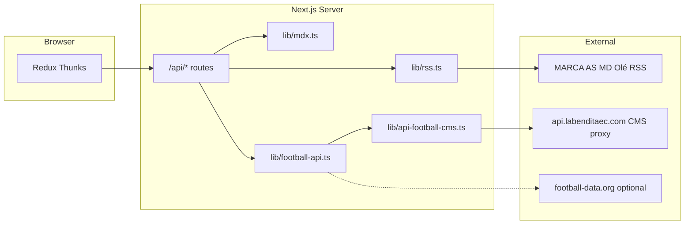

# FútHoy — Codebase Structure & Features (Current)

> **Last updated:** May 2026  
> **Repository:** [github.com/ankur1touch/spanishwebsite](https://github.com/ankur1touch/spanishwebsite)  
> **Live stack:** Next.js 15 · React 19 · TypeScript · Tailwind CSS · Redux Toolkit · next-intl

This document describes the **current** project layout, features, data flows, and configuration. Use it as a single reference for onboarding or handoff.

---

## Table of Contents

1. [Project Summary](#1-project-summary)
2. [Tech Stack](#2-tech-stack)
3. [Directory Structure](#3-directory-structure)
4. [Pages & Routes](#4-pages--routes)
5. [Features (User-Facing)](#5-features-user-facing)
6. [API Routes (Backend)](#6-api-routes-backend)
7. [Data Sources](#7-data-sources)
8. [State Management (Redux)](#8-state-management-redux)
9. [Football API Integration](#9-football-api-integration)
10. [News System](#10-news-system)
11. [Internationalization (i18n)](#11-internationalization-i18n)
12. [UI Components](#12-ui-components)
13. [SEO & Feeds](#13-seo--feeds)
14. [Environment Variables](#14-environment-variables)
15. [Legacy URL Redirects](#15-legacy-url-redirects)
16. [What Is Not Built Yet](#16-what-is-not-built-yet)

---

## 1. Project Summary

**FútHoy** is a Spanish-language football news portal (FIFA.com–style layout) focused on:

- Aggregated headlines from major sports RSS feeds
- Original long-form articles (MDX)
- Live scores, league standings, and top scorers per country
- Five country hubs: México, Colombia, Argentina, España, Perú
- Spanish (default) and English locales

The browser **never** calls external football APIs directly. All football data goes through **Next.js API routes** → **server-side CMS proxy** (API key stays on the proxy backend).

---

## 2. Tech Stack

| Layer | Technology |
|-------|------------|
| Framework | Next.js 15 (App Router, RSC, ISR) |
| Language | TypeScript (strict) |
| Styling | Tailwind CSS 3, custom brand tokens |
| i18n | next-intl (`es` default, `en`) |
| Client state | Redux Toolkit + react-redux |
| HTTP client | Axios (`lib/client.ts`) |
| News RSS | rss-parser |
| Articles | gray-matter + next-mdx-remote |
| Icons | lucide-react |
| Dates | date-fns |
| Deploy target | Vercel (`vercel.json`) |

---

## 3. Directory Structure

```
Spanish Football Website/
├── app/
│   ├── [locale]/              # All localized pages (es / en)
│   │   ├── page.tsx           # Homepage
│   │   ├── news/              # News listing + article detail
│   │   ├── matches/           # Live scores / fixtures page
│   │   ├── matches/[id]/      # Match detail (events, lineups, stats, H2H)
│   │   ├── players/[id]/      # Player profile + stats + recent fixtures
│   │   ├── teams/[id]/        # Team squad, fixtures, league position
│   │   ├── standings/         # Full standings page
│   │   ├── search/            # Client-side news search
│   │   ├── world-cup/         # World Cup news hub
│   │   ├── country/[id]/      # Per-country hub (5 countries)
│   │   ├── contacto/          # Static: contact
│   │   ├── privacidad/        # Static: privacy
│   │   ├── publicidad/        # Static: advertising
│   │   ├── sobre-nosotros/    # Static: about
│   │   ├── layout.tsx         # Root locale layout + providers
│   │   ├── error.tsx / not-found.tsx
│   ├── api/                   # Server API routes (POST/GET)
│   │   ├── news/
│   │   ├── matches/
│   │   ├── rankings/
│   │   ├── countries/
│   │   └── country/[id]/
│   ├── rss.xml/route.ts       # Site RSS feed
│   ├── robots.ts
│   ├── sitemap.ts
│   └── globals.css
├── components/
│   ├── layout/                # Header, Nav, Footer, ticker, search
│   ├── home/                  # Hero, news cards, highlights
│   ├── article/               # Article header, body, related
│   ├── news/                  # News listing client
│   ├── matches/               # Matches, match detail, standings pages
│   ├── players/               # Player detail components
│   ├── teams/                 # Team detail components
│   ├── country/               # Country header, news, football widgets
│   ├── search/                # Search client
│   ├── sidebar/               # Live scores, table, scorers, HomeSidebarData
│   └── ui/                    # Badge, Button, Skeleton, ErrorState, etc.
├── content/articles/          # MDX original articles (7 files)
├── data/
│   └── countries.json         # Country config + league IDs + keywords
├── i18n/
│   ├── routing.ts             # locales: es, en
│   ├── navigation.ts          # Locale-aware Link
│   └── request.ts             # next-intl request config
├── lib/
│   ├── api-football-cms.ts    # CMS proxy client (server-only)
│   ├── football-api.ts        # Unified football data + fallbacks
│   ├── football-endpoints.ts  # Postman-aligned path constants
│   ├── country-leagues.ts     # Resolve leagueId/season per country
│   ├── api/                   # Axios wrappers → /api/*
│   ├── client.ts              # Axios instance
│   ├── rss.ts                 # RSS aggregation
│   ├── mdx.ts                 # MDX article loader
│   ├── memory-cache.ts        # In-memory TTL cache
│   └── utils.ts, dates.ts, types.ts
├── messages/
│   ├── es.json                # Spanish UI strings
│   └── en.json                # English UI strings
├── store/
│   ├── StoreProvider.tsx
│   ├── index.ts
│   ├── hooks.ts
│   └── features/              # news, matches, rankings, countries + detail slices
├── types/                     # news, match, matchDetail, player, team, ranking, country
├── middleware.ts              # next-intl locale middleware
├── next.config.mjs            # images, redirects, next-intl plugin
├── PROJECT_DOCUMENTATION.md   # FIFA-style product doc (14 sections)
└── CODEBASE_OVERVIEW.md       # This file
```

---

## 4. Pages & Routes

All user pages live under `app/[locale]/`. Default locale `es` uses prefix **as-needed** (e.g. `/news` not `/es/news`; English uses `/en/...`).

| Route | File | Type | Description |
|-------|------|------|-------------|
| `/` | `page.tsx` | SSG + revalidate 300s | Homepage: news feed, highlights, sidebar widgets |
| `/news` | `news/page.tsx` | Client | Full news listing (RSS + MDX merged) |
| `/news/[slug]` | `news/[slug]/page.tsx` | SSG | Single MDX article with related news |
| `/matches` | `matches/page.tsx` | Client | All fixtures grouped by competition |
| `/matches/[id]` | `matches/[id]/page.tsx` | Dynamic | Match detail: score, events, lineups, stats, H2H |
| `/players/[id]` | `players/[id]/page.tsx` | Dynamic | Player profile, season stats, recent fixtures |
| `/teams/[id]` | `teams/[id]/page.tsx` | Dynamic | Team header, squad, fixtures, league standing |
| `/standings` | `standings/page.tsx` | Client | Full La Liga (default) standings table |
| `/search` | `search/page.tsx` | Client | Search headlines by keyword (news only) |
| `/world-cup` | `world-cup/page.tsx` | Client | World Cup themed news listing |
| `/country/[id]` | `country/[id]/page.tsx` | SSG | Country hub: news + football section |
| `/contacto` | `contacto/page.tsx` | Static | Contact page |
| `/privacidad` | `privacidad/page.tsx` | Static | Privacy policy |
| `/publicidad` | `publicidad/page.tsx` | Static | Advertising info |
| `/sobre-nosotros` | `sobre-nosotros/page.tsx` | Static | About us |

**Country IDs (static params):** `mexico`, `colombia`, `argentina`, `spain`, `peru`

---

## 5. Features (User-Facing)

### 5.1 Navigation

- **Desktop:** Red nav bar — News, World Cup, 🇲🇽 México, 🇨🇴 Colombia, 🇦🇷 Argentina, 🇪🇸 España, 🇵🇪 Perú
- **Mobile:** Hamburger menu (`MobileNav.tsx`) with same links
- **Header:** Logo, search icon → `/search`, locale switcher (ES / EN)
- **Breaking ticker:** Top headlines strip from RSS (`BreakingTicker.tsx`)

### 5.2 Homepage

| Section | Component | Data source |
|---------|-----------|-------------|
| Main news grid | `HomeNewsClient` | Redux → `POST /api/news` |
| Highlight cards | `HighlightVideoCard` | Static placeholder content |
| Live scores | `LiveScoresWidget` | Redux → `POST /api/matches` (rows link to `/matches/[id]`) |
| Standings (top 8) | `StandingsTable` | Redux → `POST /api/rankings` via `HomeSidebarData` (single fetch) |
| Top scorers (top 8) | `TopScorersWidget` | Same rankings payload; team/player names link to detail pages |

### 5.3 Country Pages (`/country/[id]`)

Each country page includes:

1. **CountryHeader** — flag, name, description, leagues list
2. **CountryFootballSection** — matches list + standings table + top scorers (league-specific via `leagueId` in `countries.json`)
3. **CountryNewsClient** — news filtered by country keywords

### 5.4 News

- **RSS aggregation** from MARCA, AS, Mundo Deportivo, Olé (headlines link out to source)
- **MDX articles** in `content/articles/` (full content on-site)
- **Category filter** via API body `{ category }` (World Cup page uses this)
- **Country filter** via keyword matching on title/excerpt/tag

### 5.5 Football Data

| Widget / Page | Shows | Default league |
|---------------|-------|----------------|
| Live scores sidebar | Live / upcoming / recent fixtures | Spain La Liga (140) |
| Standings sidebar | Top 8 table rows | Spain 140 |
| Top scorers sidebar | Top 8 goal scorers | Spain 140 |
| `/matches` | Full fixture list by competition | Spain 140 |
| `/standings` | Full standings table | Spain 140 |
| Country football section | League for that country | Per `countries.json` |
| `/matches/[id]` | Fixture, events, lineups, stats, head-to-head | From fixture |
| `/players/[id]` | Profile, season statistics, last 5 fixtures | `FOOTBALL_API_SEASON` |
| `/teams/[id]` | Squad, upcoming/results, league position | League from latest team fixture |

**Tabs for matches API:** `live` | `upcoming` | `results` (optional in POST body)

**Detail data flow:** Browser → Redux detail slice → `POST /api/matches|players|teams/[id]` → `lib/api-football-cms.ts` → CMS proxy (`/match/{id}`, `/events`, `/stats`, `/lineups`, `/headtohead`, `/players`, `/players-squads`, etc.).

### 5.6 Search

- Client-side filter over loaded news articles (title, excerpt, tag, source)
- Does **not** search players or external API yet

### 5.7 Static / Legal Pages

Contact, privacy, advertising, about — server-rendered with translations.

### 5.8 Newsletter CTA

Footer area newsletter call-to-action (`NewsletterCTA.tsx`) — UI only (no backend submission wired).

---

## 6. API Routes (Backend)

All football/news data for the client goes through these routes. The browser uses **POST** via Axios; **GET** is also supported for debugging.

| Endpoint | Method | Body (optional) | Returns |
|----------|--------|-----------------|---------|
| `/api/news` | POST, GET | `{ category?: string }` | `NewsItem[]` |
| `/api/matches` | POST, GET | `{ countryId?: string, tab?: 'live' \| 'upcoming' \| 'results' }` | `LiveMatch[]` |
| `/api/matches/[id]` | POST, GET | — | `MatchDetailPayload` (fixture, lineups, events, stats, h2h) |
| `/api/players/[id]` | POST, GET | — | `PlayerDetailPayload` |
| `/api/teams/[id]` | POST, GET | — | `TeamDetailPayload` |
| `/api/rankings` | POST, GET | `{ countryId?: string }` | `{ standings, topScorers }` |
| `/api/countries` | POST, GET | — | `Country[]` from JSON |
| `/api/country/[id]` | POST, GET | — | `NewsItem[]` filtered for country |

**Cache headers:**

- News / country news: `s-maxage=300`
- Matches: `s-maxage=60`
- Rankings: `s-maxage=600`

---

## 7. Data Sources



| Source | Used for | Auth |
|--------|----------|------|
| RSS feeds | Headlines, breaking ticker | None (public RSS) |
| `content/articles/*.mdx` | Full articles | Local files |
| API-Football CMS proxy | Standings, fixtures, live, topscorers | **None in app** (proxy holds key) |
| Football-Data.org | Fallback for Spain only | `FOOTBALL_DATA_TOKEN` (optional) |
| Static fallbacks | Last resort in `football-api.ts` | Hardcoded demo data |

---

## 8. State Management (Redux)

**Provider:** `store/StoreProvider.tsx` wraps the app in `app/[locale]/layout.tsx`.

| Slice | Thunks | State |
|-------|--------|-------|
| `newsSlice` | `fetchNews`, `fetchNewsByCategory`, `fetchNewsByCountry` | `articles`, `byCountry`, `status`, `countryStatus`, `error` |
| `matchesSlice` | `fetchMatches({ countryId?, tab? })` | `matches`, `status`, `error`, `countryId`, `tab` |
| `rankingsSlice` | `fetchRankings({ countryId? })` | `standings`, `topScorers`, `status`, `error`, `countryId` |
| `countriesSlice` | `fetchCountries` | `countries`, `status`, `error` |
| `matchDetailSlice` | `fetchMatchDetail(id)` | `detail`, `status`, `error` |
| `playerDetailSlice` | `fetchPlayerDetail(id)` | `player`, `statistics`, `fixtures`, `status`, `error` |
| `teamDetailSlice` | `fetchTeamDetail(id)` | `team`, `squad`, `fixtures`, `results`, `standings`, `status`, `error` |

**Client API layer:** `lib/api/*.ts` → `axiosClient.post('/api/...')`

**Note:** Homepage uses `HomeSidebarData` to fetch rankings once for both sidebar widgets.

---

## 9. Football API Integration

### 9.1 Proxy-safe design

- Base URL: `FOOTBALL_API_BASE_URL` (default `https://api.labenditaec.com/api/football`)
- **No** `FOOTBALL_API_KEY` in the app — proxy authenticates server-side
- Paths aligned with Postman collection **API-Football CMS Collection**

### 9.2 Active CMS endpoints (implemented)

| Endpoint constant | Path | Used by |
|-------------------|------|---------|
| `standings` | `/standings?league=&season=` | `fetchCmsStandings` |
| `topScorers` | `/topscorers?league=&season=` | `fetchCmsTopScorers` |
| `live` | `/live` | `fetchCmsLiveMatches` (filter by `league.id` in code) |
| `fixtures` | `/fixtures?league=&season=&next=` or `&last=` | `fetchCmsFixtures`, `fetchCmsMatchesForLeague` |

### 9.3 Country → league mapping (`data/countries.json`)

| Country | `leagueId` | League | `season` |
|---------|------------|--------|----------|
| spain | 140 | La Liga | 2025 |
| mexico | 262 | Liga MX | 2025 |
| colombia | 239 | Primera A | 2025 |
| argentina | 128 | Liga Profesional | 2025 |
| peru | 281 | Liga 1 | 2025 |

Default when no `countryId`: **Spain / 140**.

Resolver: `lib/country-leagues.ts` → `resolveCountryLeague(countryId?)`

### 9.4 Fallback chain (`lib/football-api.ts`)

For each request:

1. **CMS proxy** (primary)
2. **Football-Data.org** (Spain only, if `FOOTBALL_DATA_TOKEN` set)
3. **Static arrays** (`FALLBACK_STANDINGS`, `FALLBACK_MATCHES`, `FALLBACK_SCORERS`)

In-memory TTL caches keyed by `countryId:leagueId:season` (and `tab` for matches).

### 9.5 Postman endpoints defined but not wired in UI yet

Listed in `lib/football-endpoints.ts` for future use:

`leagues`, `teams`, `players`, `match/:id`, `lineups`, `events`, `stats`, `predictions`, `odds`, `topassists`, `topcards`, `injuries`, `headtohead`, etc.

---

## 10. News System

### RSS sources (`lib/rss.ts`)

| Source | Feed URL | Default tag |
|--------|----------|-------------|
| MARCA | marca.uecdn.es … primera-division | La Liga |
| AS | as.com … primera | La Liga |
| Mundo Deportivo | mundodeportivo.com … futbol | La Liga |
| Olé | ole.com.ar … futbol-internacional | Champions |

- 5-minute in-memory cache per feed merge
- Images extracted from enclosure / media tags when available

### MDX articles (`content/articles/`)

| Slug (example) | Topic |
|----------------|-------|
| `mbappe-gol-olimpico-clasico` | Real Madrid vs Barcelona |
| `barca-bayern-champions-vuelta` | Champions League |
| `argentina-brasil-copa-america-buenos-aires` | Copa América |
| `atletico-endrick-fichaje-real-madrid` | Transfers |
| `espana-domina-europa-numeros` | Spain national team |
| `sevilla-destitucion-entrenador-betis` | La Liga clubs |
| `vinicius-renueva-real-madrid-2030` | Real Madrid |

Frontmatter fields: `title`, `slug`, `date`, `author`, `tag`, `image`, `excerpt`, `exclusive`

### Country news filtering

`app/api/country/[id]/route.ts` matches merged news against `keywords[]` in `countries.json` (case-insensitive substring on title + excerpt + tag).

---

## 11. Internationalization (i18n)

| Setting | Value |
|---------|-------|
| Locales | `es` (default), `en` |
| Prefix | `as-needed` — Spanish URLs omit `/es` |
| Messages | `messages/es.json`, `messages/en.json` |
| Middleware | `middleware.ts` — excludes `/api`, `_next`, static files |

Namespaces include: `site`, `nav`, `home`, `sidebar`, `country`, `search`, `states`, etc.

---

## 12. UI Components

### Layout

| Component | Role |
|-----------|------|
| `Header` | Logo, search, locale, mobile menu |
| `Nav` | Desktop red navigation |
| `MobileNav` | Mobile drawer |
| `Footer` | Links, copyright |
| `BreakingTicker` | Scrolling headlines |
| `LocaleSwitcher` | ES / EN toggle |
| `SearchButton` | Link to `/search` |

### Reusable UI (`components/ui/`)

`Badge`, `Button`, `Skeleton`, `EmptyState`, `ErrorState`, `Tabs`, `Tag`, `RelativeTime`, `HydrationSafeButton`

### Design tokens (Tailwind)

Brand colors: `brand-red`, `brand-navy`, `brand-surface`, `brand-border`  
Fonts: Inter (body), Playfair Display (display headings)

---

## 13. SEO & Feeds

| Asset | Path | Notes |
|-------|------|-------|
| Sitemap | `app/sitemap.ts` | Locales + news slugs + country pages |
| Robots | `app/robots.ts` | Crawl rules |
| RSS | `/rss.xml` | Last 50 MDX articles |
| JSON-LD | `layout.tsx` | `NewsMediaOrganization` schema |
| Metadata | Per-page `generateMetadata` | OpenGraph, titles |

**Image domains** (`next.config.mjs`): marca.com, as.com, mundodeportivo.com, media.api-sports.io, unsplash, football-data crests, etc.

---

## 14. Environment Variables

| Variable | Required | Purpose |
|----------|----------|---------|
| `FOOTBALL_API_BASE_URL` | No | CMS proxy base (default: labenditaec) |
| `FOOTBALL_API_SEASON` | No | Default season year (default: `2025`) |
| `FOOTBALL_DATA_TOKEN` | No | Optional Football-Data.org fallback |
| `NEXT_PUBLIC_SITE_URL` | Recommended | SEO, sitemap, OG URLs |

**Not used (removed for security):** `FOOTBALL_API_KEY`, `RAPIDAPI_KEY`

**Never commit:** `.env.local` (gitignored)

---

## 15. Legacy URL Redirects

Old Spanish URLs redirect permanently in `next.config.mjs`:

| Old path | New path |
|----------|----------|
| `/noticias/*` | `/news/*` |
| `/mundial` | `/world-cup` |
| `/resultados` | `/matches` |
| `/clasificacion` | `/standings` |
| `/la-liga` | `/country/spain` |
| `/champions`, `/transfers`, `/analisis` | `/news` |
| `/equipos/*` | `/country/spain` |

English paths under `/en/...` follow the same rules.

---

## 16. What Is Not Built Yet

Features present in the Postman collection but **not** integrated in the UI:

- Player search (`/players?search=`) — API/UI stretch only
- Top assists / top cards widgets
- Predictions, odds, bookmakers
- Injuries endpoint
- User accounts / auth
- Newsletter backend
- Real video highlights (homepage uses static placeholders)
- CMS admin panel

---

## Quick Reference: Request Flow (Homepage Load)

```
1. User opens /
2. HomeNewsClient      → dispatch(fetchNews)      → POST /api/news
3. LiveScoresWidget    → dispatch(fetchMatches)   → POST /api/matches
4. HomeSidebarData     → dispatch(fetchRankings)  → POST /api/rankings (once)
5. StandingsTable + TopScorersWidget read shared Redux rankings state
6. Server routes call lib/football-api → lib/api-football-cms → proxy
7. UI renders real La Liga data (or fallback if proxy fails); clicks open `/matches|players|teams/[id]`
```

---

## Related Documentation

- [`PROJECT_DOCUMENTATION.md`](PROJECT_DOCUMENTATION.md) — Product vision, FIFA-style reference structure (14 sections)
- [`.env.example`](.env.example) — Environment template
- Postman collection: **API-Football CMS Collection** (Admintkcorp workspace)

---

*Generated from the current `main` branch codebase. Update this file when adding routes, API integrations, or major refactors.*
