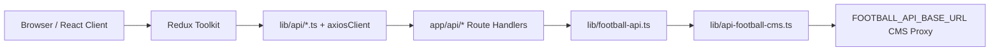

# FútHoy — Project Guide (Structure, Stack, Patterns, API)

> **Single reference document** for the current codebase.  
> **Last updated:** May 2026  
> **Repo:** Spanish Football Website (FútHoy)

---

## Table of Contents

1. [Project Overview](#1-project-overview)
2. [Tech Stack](#2-tech-stack)
3. [Architecture & Patterns](#3-architecture--patterns)
4. [Directory Structure](#4-directory-structure)
5. [Pages & Routes](#5-pages--routes)
6. [Features](#6-features)
7. [API Setup (Complete)](#7-api-setup-complete)
8. [Redux State Management](#8-redux-state-management)
9. [Internationalization (i18n)](#9-internationalization-i18n)
10. [UI & Design System](#10-ui--design-system)
11. [Environment Variables](#11-environment-variables)
12. [Scripts & Local Development](#12-scripts--local-development)
13. [SEO & Static Assets](#13-seo--static-assets)
14. [What Is Not Implemented](#14-what-is-not-implemented)

---

## 1. Project Overview

**FútHoy** is a Spanish-language football news portal (FIFA.com–style layout) with:

- Aggregated RSS headlines (MARCA, AS, Mundo Deportivo, Olé)
- On-site MDX articles
- Live scores, fixtures, standings, top scorers (La Liga default)
- **Match / Player / Team detail pages**
- Spanish (default) and English locales

**Security rule:** The browser **never** calls external football APIs directly. All football data goes through **Next.js API routes** → **server-side CMS proxy** (`api.labenditaec.com`). No API keys in client code.

---

## 2. Tech Stack

| Layer | Technology | Version (approx.) |
|-------|------------|-------------------|
| Framework | Next.js (App Router, RSC, ISR) | 15.x |
| UI | React | 19.x |
| Language | TypeScript (strict) | 5.6+ |
| Styling | Tailwind CSS 3 + custom brand tokens | 3.4+ |
| Client state | Redux Toolkit + react-redux | 2.12+ |
| HTTP (browser → own API) | Axios | 1.16+ |
| i18n | next-intl | 3.26+ |
| News RSS | rss-parser | 3.13+ |
| Articles | gray-matter + next-mdx-remote | — |
| Icons | lucide-react | — |
| Dates | date-fns | 4.x |
| Images | next/image + sharp | — |
| Deploy | Vercel-ready (`vercel.json`) | — |

---

## 3. Architecture & Patterns

### 3.1 Data flow (football)



### 3.2 Data flow (news)

```mermaid
flowchart LR
  Client[Client Components]
  ReduxNews[newsSlice]
  ApiNews[lib/api/news.ts]
  RouteNews[/api/news]
  RSS[lib/rss.ts]
  MDX[lib/mdx.ts]

  Client --> ReduxNews --> ApiNews --> RouteNews
  RouteNews --> RSS
  RouteNews --> MDX
```

### 3.3 Core patterns

| Pattern | Where | Description |
|---------|--------|-------------|
| **Proxy-safe API** | All football data | Client only `POST`/`GET` to `/api/*`; CMS key stays on proxy server |
| **BFF (Backend for Frontend)** | `app/api/**` | Route handlers aggregate/transform data for the UI |
| **Redux async thunks** | `store/features/*` | Client fetches via `lib/api/*` wrappers |
| **Server Components + Client islands** | `app/[locale]/**` | Thin `page.tsx` (metadata, locale) + `*Client.tsx` for interactivity |
| **Locale-aware routing** | `@/i18n/navigation` | Use `Link`, `useRouter`, `usePathname` from `i18n/navigation.ts`, not `next/link` |
| **Next.js 15 params** | Dynamic pages | `params: Promise<{ locale; id }>` + `await params` |
| **ISR / revalidate** | Pages & `cmsFetch` | `export const revalidate = N` on pages; `next: { revalidate }` on server fetches |
| **In-memory cache** | `lib/memory-cache.ts` | Per-key TTL caches in `football-api.ts` for standings/matches/scorers |
| **Fallback chain** | `lib/football-api.ts` | CMS proxy first → Football-Data.org (optional token) → static fallback matches |
| **Typed domain models** | `types/*` | `LiveMatch` (flat list), `FixtureDetail` (nested API shape for detail pages) |

### 3.4 File naming conventions

- **Pages:** `app/[locale]/<route>/page.tsx` (Server Component)
- **Client UI:** `components/<area>/<Name>Client.tsx` or `*Widget.tsx`
- **API routes:** `app/api/<resource>/route.ts` or `app/api/<resource>/[id]/route.ts`
- **Client API wrappers:** `lib/api/<resource>.ts` → `axiosClient.post('/api/...')`
- **Server CMS calls:** `lib/api-football-cms.ts` (never imported in `'use client'` files)
- **Messages:** `messages/es.json`, `messages/en.json` (namespaces: `nav`, `home`, `detail`, …)

---

## 4. Directory Structure

```
Spanish Football Website/
├── app/
│   ├── [locale]/                    # All localized pages (es / en)
│   │   ├── page.tsx                 # Homepage
│   │   ├── layout.tsx               # Header, footer, Redux, next-intl
│   │   ├── news/                    # Listing + [slug] MDX articles
│   │   ├── matches/                 # Fixtures list
│   │   ├── matches/[id]/            # Match detail (events, lineups, stats, H2H)
│   │   ├── standings/               # Full La Liga table
│   │   ├── players/                 # Top scorers list
│   │   ├── players/[id]/          # Player profile
│   │   ├── teams/[id]/            # Team detail
│   │   ├── world-cup/               # World Cup news hub
│   │   ├── search/                  # Search results (?q=)
│   │   ├── country/[id]/          # Country hubs (still available, not in main nav)
│   │   ├── contacto, privacidad, publicidad, sobre-nosotros
│   │   ├── error.tsx, not-found.tsx
│   ├── api/                         # Route handlers (BFF)
│   │   ├── news/route.ts
│   │   ├── matches/route.ts
│   │   ├── matches/[id]/route.ts
│   │   ├── rankings/route.ts
│   │   ├── players/[id]/route.ts
│   │   ├── teams/[id]/route.ts
│   │   ├── countries/route.ts
│   │   └── country/[id]/route.ts
│   ├── rss.xml/route.ts
│   ├── robots.ts
│   ├── sitemap.ts
│   └── globals.css
├── components/
│   ├── layout/        # Header, Nav, Footer, HeaderSearch, BreakingTicker, …
│   ├── home/          # HomeNewsClient, HeroCard, HighlightVideoCard
│   ├── matches/       # MatchesClient, MatchDetail*, MatchCardRow, StandingsClient
│   ├── players/       # PlayerDetail*, TopScorersPageClient
│   ├── teams/         # TeamDetail*
│   ├── sidebar/       # LiveScoresWidget, StandingsTable, TopScorersWidget, HomeSidebarData
│   ├── news/          # NewsListingClient
│   ├── search/        # SearchClient
│   ├── country/       # Country hub components
│   ├── article/       # MDX article layout
│   └── ui/            # Badge, Button, Skeleton, Tabs, ErrorState, …
├── content/articles/  # MDX original articles (*.mdx)
├── data/
│   └── countries.json # Country metadata + leagueId + keywords
├── i18n/
│   ├── routing.ts     # locales: es (default), en
│   ├── navigation.ts  # Locale-aware Link / router
│   └── request.ts     # next-intl request config + message loaders
├── lib/
│   ├── api-football-cms.ts   # CMS proxy client (SERVER ONLY)
│   ├── football-api.ts       # Unified football + fallbacks
│   ├── football-endpoints.ts # Postman-aligned path constants
│   ├── country-leagues.ts    # leagueId/season per country
│   ├── client.ts             # Axios instance (axiosClient)
│   ├── api/                  # Browser → /api/* wrappers
│   ├── rss.ts, mdx.ts, memory-cache.ts, match-status.ts, utils.ts
├── messages/
│   ├── es.json
│   └── en.json
├── store/
│   ├── StoreProvider.tsx
│   ├── index.ts
│   ├── hooks.ts
│   └── features/      # news, matches, rankings, countries, *Detail slices
├── types/             # news, match, matchDetail, player, team, ranking, country
├── middleware.ts      # next-intl locale middleware
├── next.config.mjs    # images, redirects, next-intl plugin
├── .env.example
├── PROJECT_GUIDE.md   # This file
├── CODEBASE_OVERVIEW.md
└── README.md
```

---

## 5. Pages & Routes

All user pages live under `app/[locale]/`. Default locale **`es`** uses prefix **as-needed** (`/news` not `/es/news`; English uses `/en/...`).

| Route | File | Type | Description |
|-------|------|------|-------------|
| `/` | `page.tsx` | SSG + revalidate 300s | Homepage: news, highlights, sidebar widgets |
| `/news` | `news/page.tsx` | Client | Full news listing |
| `/news/[slug]` | `news/[slug]/page.tsx` | SSG | Single MDX article |
| `/matches` | `matches/page.tsx` | Client | Fixtures grouped by competition |
| `/matches/[id]` | `matches/[id]/page.tsx` | Dynamic | Match detail tabs |
| `/standings` | `standings/page.tsx` | Client | Full standings table |
| `/players` | `players/page.tsx` | Client | Top scorers → player links |
| `/players/[id]` | `players/[id]/page.tsx` | Dynamic | Player profile + stats |
| `/teams/[id]` | `teams/[id]/page.tsx` | Dynamic | Squad, fixtures, league position |
| `/world-cup` | `world-cup/page.tsx` | Client | World Cup filtered news |
| `/search?q=` | `search/page.tsx` | Client | News search results (header search) |
| `/country/[id]` | `country/[id]/page.tsx` | SSG | Country hub (optional URL, not in nav) |
| `/contacto`, `/privacidad`, … | static pages | Static | Legal / info |

### Main navigation (header + red bar)

| Label (ES) | Path |
|------------|------|
| Noticias | `/news` |
| Partidos | `/matches` |
| Clasificación | `/standings` |
| Jugadores | `/players` |
| Copa del Mundo | `/world-cup` |

**Search:** Header bar only (`HeaderSearch`) → `/search?q=...` (not in nav menu).

---

## 6. Features

### 6.1 News

- RSS from MARCA, AS, Mundo Deportivo, Olé (`lib/rss.ts`)
- MDX articles in `content/articles/` (`lib/mdx.ts`)
- Merged in `/api/news`, sorted by date
- Category filter: `{ category }` in POST body (World Cup page)
- Country filter: keyword match via `/api/country/[id]`

### 6.2 Football widgets & pages

| Feature | Component / Page | Data |
|---------|------------------|------|
| Live scores sidebar | `LiveScoresWidget` | `POST /api/matches` |
| Standings sidebar | `StandingsTable` | `POST /api/rankings` (via `HomeSidebarData` — **one fetch**) |
| Top scorers sidebar | `TopScorersWidget` | Same rankings payload |
| Matches page | `MatchesClient` + `MatchCardRow` | Matches + links to detail |
| Standings page | `StandingsClient` | Full table, team links |
| Players page | `TopScorersPageClient` | Top scorers → `/players/[id]` |
| Match detail | `MatchDetailClient` | Events, lineups, stats, H2H tabs |
| Player detail | `PlayerDetailClient` | Profile, season stats, fixtures |
| Team detail | `TeamDetailClient` | Squad, fixtures, results, league position |

### 6.3 Search

- **Header:** `HeaderSearch` — Enter → `/search?q=term`
- **Results:** `SearchClient` filters loaded news client-side

### 6.4 i18n

- Locales: `es` (default), `en`
- All UI strings in `messages/*.json`
- Detail pages use `detail` namespace for tabs/errors

### 6.5 Other

- Breaking news ticker (`BreakingTicker`)
- Newsletter CTA (UI only, no backend)
- Legacy URL redirects in `next.config.mjs` (`/resultados` → `/matches`, etc.)

---

## 7. API Setup (Complete)

### 7.1 Principle: three layers

```
┌─────────────────────────────────────────────────────────────┐
│  LAYER 1 — Browser (Client Components + Redux)              │
│  axiosClient.post('/api/matches', { tab: 'live' })          │
│  Never calls api.labenditaec.com or api-sports directly     │
└────────────────────────────┬────────────────────────────────┘
                             │
┌────────────────────────────▼────────────────────────────────┐
│  LAYER 2 — Next.js Route Handlers (app/api/**)              │
│  runtime = 'nodejs', dynamic = 'force-dynamic'              │
│  Cache-Control: s-maxage on responses                       │
└────────────────────────────┬────────────────────────────────┘
                             │
┌────────────────────────────▼────────────────────────────────┐
│  LAYER 3 — Server libraries                                 │
│  lib/football-api.ts  → orchestration, cache, fallbacks     │
│  lib/api-football-cms.ts → cmsFetch() to CMS proxy          │
└────────────────────────────┬────────────────────────────────┘
                             │
┌────────────────────────────▼────────────────────────────────┐
│  EXTERNAL — CMS Proxy (API-Football backed)                 │
│  FOOTBALL_API_BASE_URL/api/football/<endpoint>?params       │
│  API key stored on proxy — NOT in this repo                 │
└─────────────────────────────────────────────────────────────┘
```

### 7.2 Environment variables

Copy `.env.example` → `.env.local`:

| Variable | Required | Purpose |
|----------|----------|---------|
| `FOOTBALL_API_BASE_URL` | No | CMS proxy base (default: `https://api.labenditaec.com/api/football`) |
| `FOOTBALL_API_SEASON` | No | Season year for player/team endpoints (default: `2025`) |
| `FOOTBALL_DATA_TOKEN` | No | Optional Football-Data.org fallback |
| `NEXT_PUBLIC_SITE_URL` | Recommended | SEO, sitemap, OG, Axios base URL on server |

**Not used (removed for security):** `FOOTBALL_API_KEY`, `RAPIDAPI_KEY`

### 7.3 CMS client (`lib/api-football-cms.ts`)

**`cmsFetch(path, params, options)`**

- Builds URL: `{FOOTBALL_API_BASE_URL}{path}?{query}`
- Headers: `Accept: application/json` only (no API key)
- Uses `fetch` with `next: { revalidate: N }`

**`extractResponse(payload)`** — normalizes response shapes:

- `{ response: [...] }` (API-Football raw)
- `{ data: [...] }` (CMS wrapper)
- `{ results: N, response: [...] }`
- Plain array

**Postman-aligned paths** (`lib/football-endpoints.ts`):

| Constant | Path | Used for |
|----------|------|----------|
| `standings` | `/standings` | League table |
| `topScorers` | `/topscorers` | Top scorers |
| `live` | `/live` | Live matches |
| `fixtures` | `/fixtures` | Fixtures by id / team / player |
| `lineups` | `/lineups` | Match lineups (`?fixture=id`) |
| `events` | `/events` | Match events |
| `stats` | `/stats` | Match statistics |
| `headToHead` | `/headtohead` | H2H (`?h2h=homeId-awayId&last=5`) |
| `players` | `/players` | Player by id |
| `playersStatistics` | `/players-statistics` | Player stats |
| `playersSquads` | `/players-squads` | Team squad |
| `teams` | `/teams` | Team by id |

### 7.4 Next.js API routes (BFF)

| Endpoint | Methods | Body (POST) | Returns |
|----------|---------|-------------|---------|
| `/api/news` | POST, GET | `{ category?: string }` | `NewsItem[]` |
| `/api/matches` | POST, GET | `{ countryId?, tab?: 'live' \| 'upcoming' \| 'results' }` | `LiveMatch[]` |
| `/api/matches/[id]` | POST, GET | — | `MatchDetailPayload` |
| `/api/rankings` | POST, GET | `{ countryId?: string }` | `{ standings, topScorers }` |
| `/api/players/[id]` | POST, GET | — | `PlayerDetailPayload` |
| `/api/teams/[id]` | POST, GET | — | `TeamDetailPayload` |
| `/api/countries` | POST, GET | — | `Country[]` from `data/countries.json` |
| `/api/country/[id]` | POST, GET | — | `NewsItem[]` filtered by country keywords |

**Cache headers (examples):**

| Route | `s-maxage` |
|-------|------------|
| `/api/matches` | 60 |
| `/api/matches/[id]` | 60 |
| `/api/rankings` | 600 |
| `/api/players/[id]`, `/api/teams/[id]` | 300 |
| `/api/news` | 300 |

### 7.5 Client API wrappers (`lib/api/`)

| File | Calls |
|------|-------|
| `news.ts` | `POST /api/news` |
| `matches.ts` | `POST /api/matches` |
| `matchDetail.ts` | `POST /api/matches/:id` |
| `rankings.ts` | `POST /api/rankings` |
| `playerDetail.ts` | `POST /api/players/:id` |
| `teamDetail.ts` | `POST /api/teams/:id` |
| `countries.ts` | `POST /api/countries` |

**Axios client** (`lib/client.ts`):

- Named export: `axiosClient`
- Browser: `baseURL = ''` (same-origin `/api/*`)
- Server: `NEXT_PUBLIC_SITE_URL` or `http://localhost:3000`

### 7.6 Match detail aggregation (`fetchMatchDetailPayload`)

`app/api/matches/[id]/route.ts` calls `fetchMatchDetailPayload(id)`:

1. `GET /fixtures?id={id}` → normalize fixture document
2. Parallel: `/lineups`, `/events`, `/stats` with `?fixture={id}`
3. H2H: `/headtohead?h2h={homeId}-{awayId}&last=5`
4. Merge: prefer live endpoint data; fallback to embedded `events` / `statistics` / `lineups` on fixture document

**Note:** Upcoming matches (`NS`) often have empty events/stats until kick-off. Finished matches with data in the API show full tabs.

### 7.7 Football-Data.org fallback (`lib/football-api.ts`)

If CMS fails and `FOOTBALL_DATA_TOKEN` is set:

- Standings / matches may load from `https://api.football-data.org/v4`
- Static `FALLBACK_MATCHES` used as last resort for match list

### 7.8 Country leagues (`lib/country-leagues.ts` + `data/countries.json`)

Each country has `leagueId` + `season` for scoped rankings/matches:

- `mexico`, `colombia`, `argentina`, `spain`, `peru`
- Default site league: **La Liga (140)**

### 7.9 Example: homepage load

```
1. User opens /
2. HomeNewsClient      → fetchNews()       → POST /api/news
3. LiveScoresWidget    → fetchMatches()    → POST /api/matches
4. HomeSidebarData     → fetchRankings()   → POST /api/rankings (once)
5. StandingsTable + TopScorersWidget share Redux rankings state
6. User clicks match row → /matches/[id] → POST /api/matches/[id]
```

### 7.10 Testing API routes locally

```bash
# Match list
curl -X POST http://localhost:3000/api/matches -H "Content-Type: application/json" -d "{}"

# Match detail
curl -X POST http://localhost:3000/api/matches/1391181

# Rankings
curl -X POST http://localhost:3000/api/rankings -H "Content-Type: application/json" -d "{}"

# Player detail
curl -X POST http://localhost:3000/api/players/278
```

---

## 8. Redux State Management

**Provider:** `store/StoreProvider.tsx` in `app/[locale]/layout.tsx`

| Slice | Thunk | Main state |
|-------|-------|------------|
| `newsSlice` | `fetchNews`, `fetchNewsByCategory`, `fetchNewsByCountry` | `articles`, `status`, `error` |
| `matchesSlice` | `fetchMatches({ countryId?, tab? })` | `matches`, `status`, `tab` |
| `rankingsSlice` | `fetchRankings({ countryId? })` | `standings`, `topScorers`, `status` |
| `countriesSlice` | `fetchCountries` | `countries` |
| `matchDetailSlice` | `fetchMatchDetail(id)` | `detail`, `status`, `error` |
| `playerDetailSlice` | `fetchPlayerDetail(id)` | `player`, `statistics`, `fixtures` |
| `teamDetailSlice` | `fetchTeamDetail(id)` | `team`, `squad`, `fixtures`, `results`, `standings` |

**Hooks:** `useAppDispatch`, `useAppSelector` from `store/hooks.ts`

---

## 9. Internationalization (i18n)

| Setting | Value |
|---------|-------|
| Locales | `es` (default), `en` |
| URL prefix | `as-needed` — Spanish omits `/es` |
| Messages | `messages/es.json`, `messages/en.json` |
| Middleware | `middleware.ts` — excludes `/api`, `_next`, static files |
| Plugin | `createNextIntlPlugin('./i18n/request.ts')` in `next.config.mjs` |

**Important:** Import `Link` from `@/i18n/navigation`, not `next/link`.

---

## 10. UI & Design System

### Brand tokens (Tailwind)

- `brand-red`, `brand-red-dark`, `brand-navy`, `brand-surface`, `brand-border`
- Fonts: Inter (body), Playfair Display (display headings)

### Reusable UI (`components/ui/`)

`Badge`, `Button`, `Skeleton`, `EmptyState`, `ErrorState`, `Tabs`, `Tag`, `RelativeTime`, `HydrationSafeButton`

### Layout

- `Header` — logo, **HeaderSearch**, locale switcher, mobile menu
- `Nav` — red horizontal nav (no search link)
- `BreakingTicker`, `Footer`, `NewsletterCTA`

---

## 11. Environment Variables

See [section 7.2](#72-environment-variables). Never commit `.env.local`.

---

## 12. Scripts & Local Development

```bash
npm install
cp .env.example .env.local
# Optional: FOOTBALL_DATA_TOKEN, FOOTBALL_API_BASE_URL, NEXT_PUBLIC_SITE_URL

npm run dev      # http://localhost:3000
npm run build    # production build
npm run start    # production server
npm run lint     # ESLint
```

**If dev shows missing module errors** (e.g. `@formatjs` vendor chunks):

```powershell
Remove-Item -Recurse -Force .next
npm run dev
```

Do not use `next dev --turbo` unless you upgrade Next.js and verify next-intl compatibility.

---

## 13. SEO & Static Assets

| Asset | Path |
|-------|------|
| Sitemap | `app/sitemap.ts` |
| Robots | `app/robots.ts` |
| RSS feed | `/rss.xml` (MDX articles) |
| Favicon | `app/icon.svg` |

**Image domains** configured in `next.config.mjs`: marca.com, as.com, media.api-sports.io, unsplash, etc.

---

## 14. What Is Not Implemented

- Player search API/UI (`/players?search=`)
- Predictions, odds, injuries widgets
- Newsletter backend / user auth
- Real video highlights (homepage placeholders)
- CMS admin panel
- Country links in main navigation (pages still exist at `/country/[id]`)

---

## Related docs

| File | Purpose |
|------|---------|
| `README.md` | Quick start |
| `CODEBASE_OVERVIEW.md` | Shorter overview (may overlap) |
| `PROJECT_DOCUMENTATION.md` | Product / FIFA-style vision doc |
| `.env.example` | Environment template |
| Postman | **API-Football CMS Collection** (Admintkcorp workspace) |

---

*Update this file when adding routes, API integrations, or changing navigation/architecture.*
